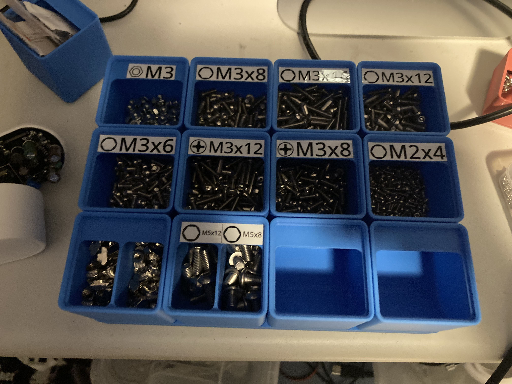

# Screw Label Generator

This simple program generates a label with a screw head and some text. This also can directly print to a PTouch Printer

I made this program so I can print labels for my GridFinity screw setup to keep track of them.



# Disclaimer

This is my first real c++ application, so it's probably messy.

This is also a personal project designed to "work once", so expected some bugs. I only tested it with my PT-2430PC label maker.

# Dependencies
- ptouch-print: [Original Link](https://dominic.familie-radermacher.ch/projekte/ptouch-print/), [own fork](https://github.com/Electro707/ptouch-print)
- cairo
- rsvg
- cxxopts

# Build

```sh
make
```

# Screw Head Image Download

As I do not known the rights to the screw head images, they are not distributed with this repository. Instead they must be downloaded.

In the images folder, `getImages.sh` can be run which will download the required images

# License

[GPLv3](LICENSE.md)
